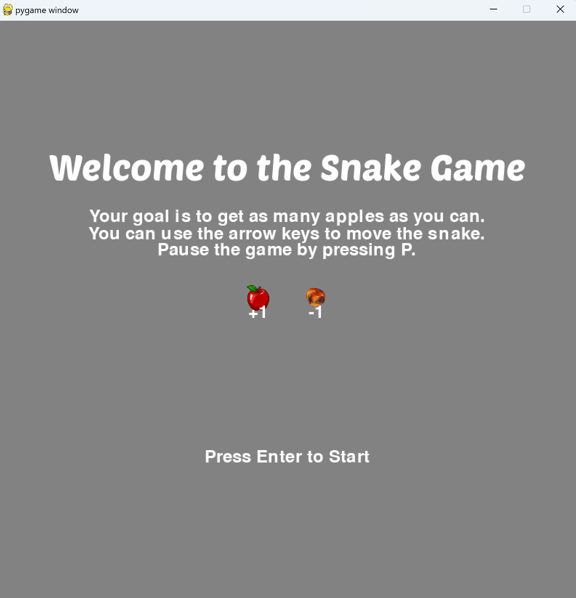
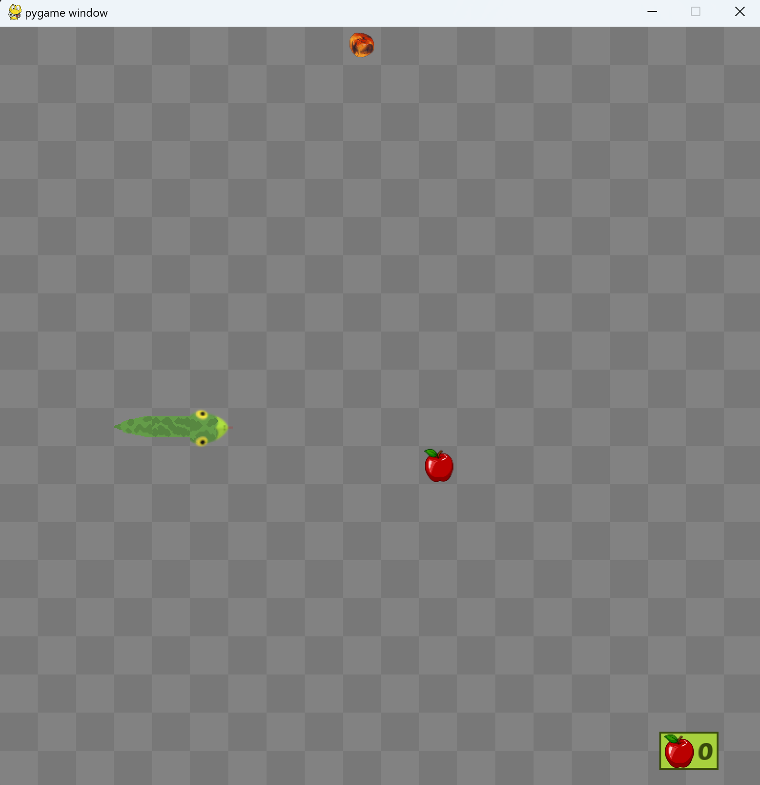
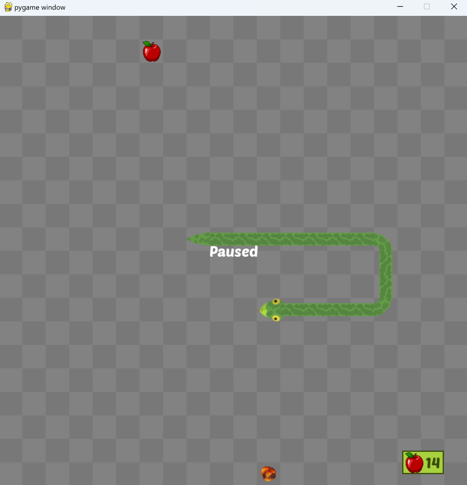
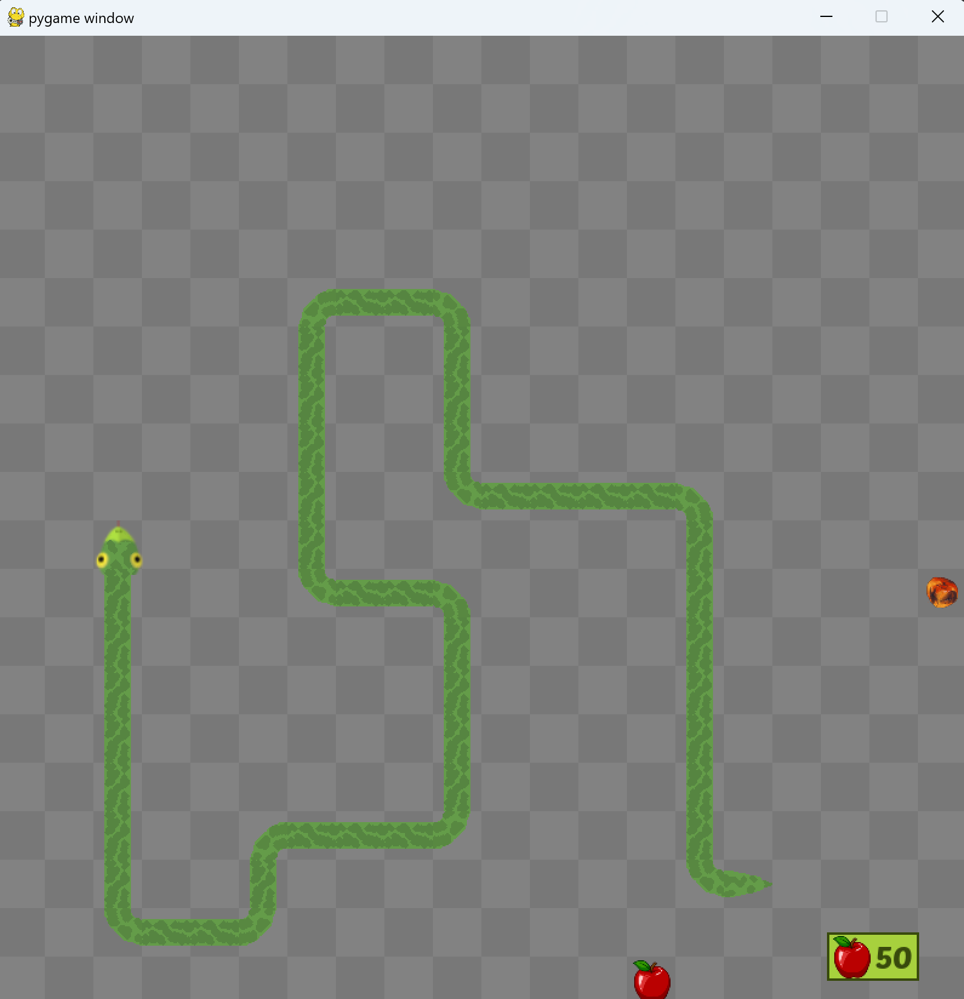

# Snake Game

## Setup

- git clone git clone https://github.com/nemethzozzi/snake
- cd snake
- python snake.py

## Controls

- Use the arrow keys to navigate the snake.
- Press `[P]` to exit the game.
- Press `[Esc]` to exit the game.

## Gameplay Features

- Score points by eating good apples (+1).
- Lose points by eating bad apples (-1).
- Random spawning of apples to keep the game challenging.
- Enjoy the classic Snake Game experience with a twist!

## Screenshots

## Scoring System

Earn points by eating good apples and watch out for bad apples that deduct points. Can you achieve the highest score?

## Random Spawning Logic

Good and bad apples spawn randomly, creating an unpredictable and dynamic gaming experience.

## Troubleshooting

If you encounter any issues, try the following:

1. Ensure Python is installed on your system.
2. Check for any error messages in the console.

Happy gaming!
